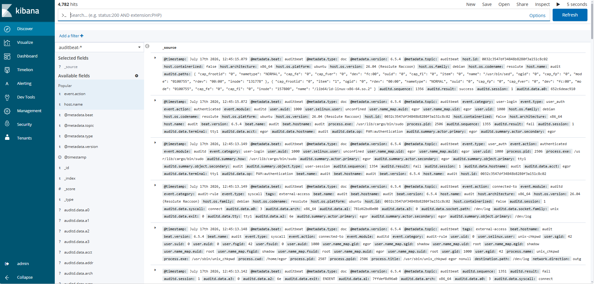
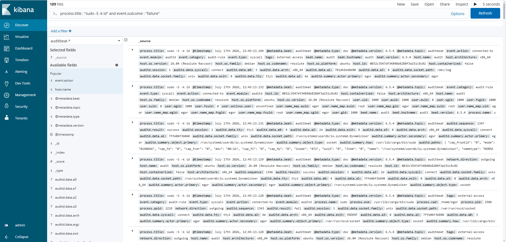

# Локальный SIEM-стек: Auditbeat + Kafka + Elasticsearch + Kibana

Пет-проект по развёртыванию SIEM для сбора, обработки и визуализации событий безопасности с Linux-хоста.

## Как это работает

Auditbeat собирает события с хоста и отправляет их в Kafka. Kafka нужна как буфер: если событий много и разом, Elasticsearch не должен их терять. Дальше Python-скрипт вычитывает сообщения из Kafka и пишет их в Elasticsearch, а Kibana показывает всё в виде поиска и дашбордов.
Auditbeat -> Kafka (топик auditbeat) -> Python-коннектор (sync.py) -> Elasticsearch -> Kibana



## Файлы в проекте

- `docker-compose.yml` — контейнеры Elasticsearch, Kibana, Kafka, Zookeeper
- `auditbeat.yml` — конфиг агента (модули auditd, file_integrity, system)
- `auditbeat.template.json` — шаблон индекса для Elasticsearch
- `sync.py` — скрипт, который читает Kafka и пишет в Elasticsearch

## Запуск

### 1. Поднять инфраструктуру

На сервере с Docker (`siem-server`):
```bash
docker-compose up -d
```

### 2. Настроить Auditbeat на отслеживаемом хосте

Auditbeat ставится на машину, за которой ведётся наблюдение (`audit`), файл `auditbeat.yml` кладётся в `/etc/auditbeat/`, служба запускается так:
```bash
sudo systemctl enable auditbeat --now
```

### 3. Запустить коннектор

На `siem-server`:
```bash
pip install kafka-python elasticsearch==7.13.0
nohup python3 sync.py > sync.log 2>&1 &
```
`nohup` и `&` нужны, чтобы скрипт продолжал работать после закрытия терминала.

## Проверка: детект брутфорса sudo

Для проверки всей системы на хосте `audit` был симулирован перебор паролей через sudo:
```bash
for i in {1..7}; do echo "hacker_pass_$i" | sudo -S -k id 2>/dev/null; done
```

Событие было поймано auditd, прошло через Kafka и коннектор и появилось в Elasticsearch. В Kibana (Discover) событие находится таким запросом:
process.title : "sudo -S -k id" and event.outcome : "failure"

Что видно в найденном событии:
- `host.name`: `audit` — хост, на котором произошла попытка
- `process.name`: `sudo`
- `process.title`: `sudo -S -k id` — точная команда
- `user.name_map.auid`: `egor` — учётная запись пользователя
- `auditd.result`: `fail`
- `event.action`: `connected-to` — обращение к сокету авторизации `/var/run/nscd/socket`


